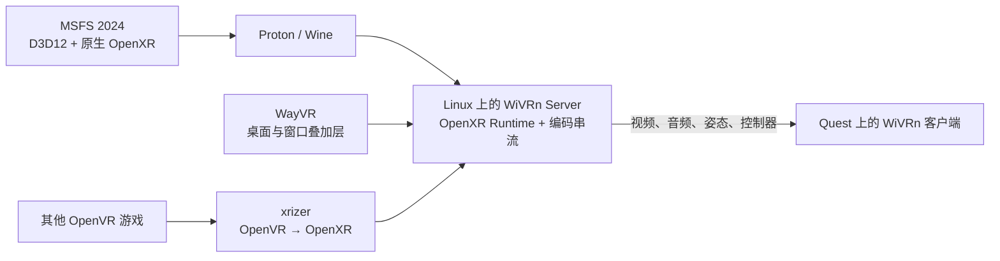

# Linux 上使用 WiVRn、WayVR、xrizer 与 Steam 运行 MSFS 2024 VR

> 文档日期：2026-07-04<br>
> 重点平台：Arch Linux、KDE Plasma Wayland、NVIDIA GPU、Meta Quest 3 / Quest Pro<br>
> 本机验证版本：WiVRn 26.6.1、WayVR 26.2.1、xrizer 0.5、OpenXR Loader 1.1.60、NVIDIA 610.43.02

## 1. 目标与重要结论

本文档说明如何在 Linux 上：

1. 使用 WiVRn 将 PC 的 VR 画面无线传输到 Meta Quest。
2. 使用 WayVR 在头显中显示 Linux 桌面、Steam 和普通窗口。
3. 使用 xrizer 兼容只支持 OpenVR 的游戏。
4. 通过 Steam 和 Proton 运行 Microsoft Flight Simulator 2024 的原生 OpenXR VR 模式。

最重要的概念是：

- **WiVRn 是 OpenXR runtime 和串流服务。**
- **MSFS 2024 本身使用原生 OpenXR，不需要 xrizer 转译。**
- **xrizer 只负责把 OpenVR 调用转换为 OpenXR，主要用于旧 VR 游戏。**
- **WayVR 是可选的 VR 桌面/叠加层，不是 MSFS 的 VR runtime。**
- **SteamVR 在这条直连链路中不是必需组件。**

## 2. 整体架构



### MSFS 2024 的实际链路

```text
FlightSimulator2024.exe
    ↓ Windows OpenXR Loader
Proton wineopenxr
    ↓ Linux OpenXR
WiVRn runtime
    ↓ Vulkan 合成 + NVENC/视频编码 + 网络
Quest WiVRn 客户端
```

因此，排查 MSFS VR 问题时，应优先检查：

1. Proton 的 OpenXR 桥接是否正常。
2. WiVRn runtime 是否被 Steam Pressure Vessel 容器导入。
3. D3D12/VKD3D、NVAPI、DLSS 和 NVIDIA 驱动是否在 VR 切换时冲突。

不应首先怀疑 xrizer，因为 MSFS 2024 并不通过 OpenVR 渲染。

## 3. 硬件和网络准备

### 推荐条件

- Meta Quest 3、Quest 3S 或 Quest Pro。
- 支持 Vulkan 和硬件视频编码的 GPU。
- NVIDIA 建议使用较新的专有或 Open Kernel Module 驱动。
- PC 使用有线千兆或更高速率连接路由器。
- Quest 使用 Wi-Fi 6/6E，尽量连接 5 GHz 或 6 GHz 独立频段。
- PC 与 Quest 位于同一局域网。

### 双 GPU 系统

WiVRn、WayVR 和 MSFS 应尽量使用同一张物理 GPU。否则可能发生：

- OpenXR runtime 要求游戏使用指定的 Vulkan 设备。
- 游戏在另一张 GPU 上创建 D3D12/Vulkan 资源。
- 跨 GPU 导入图像或同步对象失败。

检查 GPU：

```bash
vulkaninfo --summary
nvidia-smi
nvidia-smi topo -m
```

检查 WiVRn、WayVR 和 MSFS 使用的 GPU：

```bash
nvidia-smi pmon -c 1
```

## 4. Arch Linux 安装

以下包名适用于当前机器使用的原生 Arch/AUR 方案：

```bash
paru -S \
  steam \
  wivrn-dashboard \
  xrizer \
  wayvr \
  openxr \
  vulkan-tools
```

NVIDIA 用户还需确保 64 位和 32 位 Vulkan/驱动组件完整，例如：

```bash
sudo pacman -S \
  nvidia-utils \
  lib32-nvidia-utils \
  vulkan-icd-loader \
  lib32-vulkan-icd-loader
```

安装后检查：

```bash
pacman -Q | grep -E 'wivrn|xrizer|wayvr|openxr|nvidia|vulkan'
vulkaninfo --summary
```

WiVRn 官方也提供 Flatpak。本文优先使用原生包，因为原生安装在访问 OpenXR manifest、xrizer、GPU 设备和本地 socket 时通常更直接。

## 5. 网络发现和防火墙

WiVRn 使用 Avahi/mDNS 发现 PC：

```bash
sudo systemctl enable --now avahi-daemon
systemctl status avahi-daemon
```

需要开放：

- `5353/UDP`：mDNS/Avahi。
- `9757/TCP`
- `9757/UDP`

UFW 示例：

```bash
sudo ufw allow 5353/udp
sudo ufw allow 9757/tcp
sudo ufw allow 9757/udp
```

如果 Quest 看不到 PC，先检查：

```bash
systemctl is-active avahi-daemon
ss -lntup | grep -E '5353|9757'
```

## 6. 安装并配对 Quest 客户端

1. 在 PC 上启动：

   ```bash
   wivrn-dashboard
   ```

2. 首次运行时完成向导。
3. 在 Quest 上从 Meta Store 安装 WiVRn，或使用 Dashboard 提供的 APK。
4. 确认 Quest 客户端与 PC 服务端版本兼容，最好完全一致。
5. 在 Quest 中打开 WiVRn，选择 PC 并完成配对。
6. 成功后，头显应显示等待 PC 启动 OpenXR 应用的界面。

WiVRn 官方说明要求 Avahi 正常运行，并建议开放上述端口；Quest 2、Quest 3 和 Quest Pro 均可通过 Meta Store 安装客户端。

## 7. 验证 OpenXR runtime

当前用户的 active runtime 应指向 WiVRn，而不是 OpenXR Loader 或 xrizer。

检查：

```bash
readlink -f ~/.config/openxr/1/active_runtime.json
cat ~/.config/openxr/1/active_runtime.json
```

合理结果类似：

```text
/usr/share/openxr/1/openxr_wivrn.json
```

WiVRn manifest 示例：

```json
{
  "file_format_version": "1.0.0",
  "runtime": {
    "name": "Monado",
    "library_path": "../../../lib/wivrn/libopenxr_wivrn.so"
  }
}
```

如果系统安装了 OpenXR 工具，可以运行：

```bash
openxr_runtime_list
openxr_runtime_list_json
```

正常情况下应能看到：

- WiVRn runtime 版本。
- Meta Quest HMD。
- 左右控制器。
- `XR_FORM_FACTOR_HEAD_MOUNTED_DISPLAY`。
- `XR_VIEW_CONFIGURATION_TYPE_PRIMARY_STEREO`。

### 常见错误

不要把 active runtime 指向：

```text
/usr/lib/libopenxr_loader.so
```

OpenXR Loader 负责查找 runtime，它本身不是 runtime。

## 8. 配置 xrizer

xrizer 是 OpenVR 到 OpenXR 的兼容层。它可以让 OpenVR 游戏通过 WiVRn 运行，而不启动 SteamVR。

原生 Arch 包通常安装在：

```text
/opt/xrizer
```

检查：

```bash
find /opt/xrizer -maxdepth 3 -type f
```

典型文件包括：

```text
/opt/xrizer/bin/linux64/vrclient.so
/opt/xrizer/openvrpaths.vrpath
```

### 方法一：由 WiVRn 自动配置

WiVRn 会尝试自动寻找 xrizer/OpenComposite，并在运行期间调整 OpenVR 路径或设置 `VR_OVERRIDE`。这是推荐方式。

### 方法二：手动设置 VR_OVERRIDE

对于 OpenVR 游戏，可在 Steam 启动项加入：

```text
VR_OVERRIDE=/path/to/xrizer PRESSURE_VESSEL_IMPORT_OPENXR_1_RUNTIMES=1 %command%
```

注意：

- 家目录中的路径通常可直接从容器访问。
- 宿主机 `/usr` 下的路径在容器中通常位于 `/run/host/usr`。
- `/opt/xrizer` 是否直接可见取决于 WiVRn 的自动白名单和 Pressure Vessel 挂载。
- 不确定时不要猜路径，优先使用 WiVRn Dashboard 给出的启动项，并查看 Steam 控制台是否出现 `openat(...): No such file or directory`。

### 方法三：openvrpaths.vrpath

文件：

```text
~/.config/openvr/openvrpaths.vrpath
```

可包含：

```json
{
  "version": 1,
  "runtime": [
    "/opt/xrizer"
  ]
}
```

Steam、SteamVR 和 WiVRn 都可能更新这个文件，因此不要仅凭它在某一时刻指向 SteamVR 就断定 xrizer 没有被使用；应同时检查游戏进程环境和 xrizer 日志。

xrizer 日志位于：

```text
~/.local/state/xrizer/xrizer.txt
```

## 9. 配置 WayVR

WayVR 是轻量级 OpenXR/OpenVR 桌面叠加层，可在头显里：

- 查看 Wayland/X11 桌面。
- 操作 Steam。
- 启动应用。
- 使用虚拟键盘。
- 在运行 VR 游戏时保留桌面面板。

启动：

```bash
wayvr
```

配置目录：

```text
~/.config/wayvr
```

日志通常可以从终端或用户 journal 查看：

```bash
journalctl --user --since '-10 min' | grep -i wayvr
```

Wayland 下屏幕捕获通常通过 PipeWire 和桌面门户完成。首次选择显示器时，KDE 会弹出屏幕共享对话框。

如果画面黑屏、绿屏或捕获失败：

1. 在 WayVR 设置中切换 Wayland 捕获方式。
2. 从 GPU/DMA-BUF 捕获切换到 CPU/SHM 捕获测试。
3. 检查 PipeWire：

   ```bash
   systemctl --user status pipewire pipewire-pulse wireplumber
   ```

4. 检查桌面门户：

   ```bash
   systemctl --user status xdg-desktop-portal xdg-desktop-portal-kde
   ```

WayVR 是可选组件。为了排查 MSFS 崩溃，可以暂时退出 WayVR，确认问题是否与多 OpenXR 客户端或屏幕捕获有关。

## 10. Steam 和 Proton 配置

### 选择 Proton

MSFS 2024 应优先尝试：

1. 最新稳定 Proton 10。
2. Proton Experimental。
3. 如果 Experimental 出现新回归，退回稳定 Proton。

Steam 操作：

1. 右键 MSFS 2024。
2. 选择“属性”。
3. 打开“兼容性”。
4. 勾选强制使用兼容工具。
5. 选择 Proton 10 或 Proton Experimental。

Proton 的官方变更记录已将 MSFS 2024 列为 Proton 10 可运行游戏，并包含 MSFS VR 与 VR 控制器相关修复。

### 标准 WiVRn 启动项

```text
PRESSURE_VESSEL_IMPORT_OPENXR_1_RUNTIMES=1 %command% -FastLaunch
```

含义：

- `PRESSURE_VESSEL_IMPORT_OPENXR_1_RUNTIMES=1`：把宿主机的 WiVRn OpenXR runtime、manifest 和相关 socket 导入 Steam 容器。
- `%command%`：Steam 实际游戏命令。
- `-FastLaunch`：跳过部分启动动画，缩短启动时间。

`PRESSURE_VESSEL_IMPORT_OPENXR_1_RUNTIMES=1` 是这套方案的关键参数。

## 11. NVIDIA 上 MSFS 切换 VR 闪退的规避项

部分 NVIDIA 系统存在以下特征：

- MSFS 平面模式正常。
- WiVRn 和 WayVR 正常。
- 按 `Ctrl+Tab` 后，OpenXR instance 和 system 枚举成功。
- 游戏在创建 OpenXR session 前立即退出。

Proton 项目中已有相同症状报告。已验证的规避方式是暂时关闭 Proton NVAPI，并隐藏 NVIDIA 专有功能：

```text
PROTON_DISABLE_NVAPI=1 PROTON_HIDE_NVIDIA_GPU=1 PRESSURE_VESSEL_IMPORT_OPENXR_1_RUNTIMES=1 %command% -FastLaunch
```

代价：

- DLSS 不可用。
- DLSS Frame Generation 不可用。
- NVIDIA Reflex 不可用。

建议 MSFS 图形设置：

```text
桌面 Anti-Aliasing：TAA
桌面 Frame Generation：Off
桌面 Reflex：Off
VR Anti-Aliasing：TAA
VR Frame Generation：Off
VR Reflex：Off
```

如果未来 Proton 或 NVIDIA 驱动修复了该问题，可以逐项恢复：

1. 先移除 `PROTON_HIDE_NVIDIA_GPU=1`。
2. 测试 VR。
3. 再移除 `PROTON_DISABLE_NVAPI=1`。
4. 最后恢复 DLSS/Reflex。

一次只改一个变量，便于判断真正的故障点。

## 12. 推荐启动顺序

### 最稳定的启动流程

1. 关闭遗留 SteamVR 进程：

   ```bash
   pgrep -a -x vrserver
   ```

   对于 MSFS 原生 OpenXR 链路，通常不应有旧的 `vrserver` 常驻。

2. 启动 WiVRn：

   ```bash
   wivrn-dashboard
   ```

3. 在 Quest 中启动 WiVRn 并连接 PC。
4. 等待 Dashboard 显示头显已连接。
5. 可选：启动 WayVR：

   ```bash
   wayvr
   ```

6. 通过 WayVR 面板或 PC 桌面打开 Steam。
7. 从 Steam 启动 MSFS 2024。
8. 等待进入主菜单或座舱。
9. 按：

   ```text
   Ctrl+Tab
   ```

10. 等待 MSFS 创建 OpenXR session 并进入沉浸式 VR。

### 不建议的做法

- 同时手动启动 SteamVR、xrizer 和 WiVRn，除非某个游戏明确需要 SteamVR。
- 把 xrizer 当作 MSFS 2024 的 OpenXR runtime。
- 把 OpenXR Loader 本身注册为 active runtime。
- 同时修改 Proton、驱动、WiVRn、DLSS 和编码器后再测试，这会失去定位依据。

## 13. 正常状态的检查清单

### WiVRn

```bash
pgrep -a wivrn
```

应看到 `wivrn-dashboard` 和连接后的 `wivrn-server`。

### WayVR

```bash
pgrep -a wayvr
```

### OpenXR

```bash
readlink -f ~/.config/openxr/1/active_runtime.json
```

应指向 WiVRn manifest。

### Quest 设备

WiVRn/OpenXR 日志中应出现类似：

```text
Head: WiVRn HMD
Left: WiVRn left controller
Right: WiVRn right controller
```

### NVIDIA GPU

```bash
nvidia-smi pmon -c 1
```

WiVRn、WayVR 和 `FlightSimulator2024.exe` 应位于同一 GPU。

### xrizer

仅对 OpenVR 游戏检查：

```bash
tail -n 100 ~/.local/state/xrizer/xrizer.txt
```

MSFS 启动过程中 Proton 可能短暂运行 OpenVR/OpenXR 测试实例；这不代表 MSFS 主渲染链路使用 xrizer。

## 14. 日志收集

### WiVRn/WayVR/Steam

```bash
journalctl --user --since '-15 min' --no-pager \
  | grep -Ei 'wivrn|wayvr|openxr|xrizer|wine|proton'
```

### Steam 控制台日志

```bash
grep -Ei 'openxr|xrizer|vkd3d|fatal|exception|crash' \
  ~/.local/share/Steam/logs/console-linux.txt \
  | tail -n 300
```

### Proton 完整日志

临时启动项：

```text
PROTON_LOG=1 PROTON_DISABLE_NVAPI=1 PROTON_HIDE_NVIDIA_GPU=1 PRESSURE_VESSEL_IMPORT_OPENXR_1_RUNTIMES=1 %command% -FastLaunch
```

日志通常生成在：

```text
~/steam-2537590.log
```

MSFS 的 Steam AppID 是：

```text
2537590
```

注意：MSFS 的 Proton 日志可能非常大。复现一次后应移除 `PROTON_LOG=1`。

### MSFS 自身崩溃报告

```text
~/.local/share/Steam/steamapps/compatdata/2537590/pfx/drive_c/users/steamuser/AppData/Roaming/Microsoft Flight Simulator 2024/
```

重要文件：

```text
AsoboReport-Crash.txt
AsoboReport-RunningSession.txt
AsoboReport-OldCrashes/
crashdata.txt
UserCfg.opt
```

快速提取 VR 状态：

```bash
grep -E 'Where=|TimeUTC=|VR_|EnableD3D12|GPUName|DriverVersion' \
  ~/.local/share/Steam/steamapps/compatdata/2537590/pfx/drive_c/users/steamuser/AppData/Roaming/Microsoft\ Flight\ Simulator\ 2024/AsoboReport-RunningSession.txt
```

### 内核和 NVIDIA 错误

```bash
journalctl -k --since '-15 min' \
  | grep -Ei 'nvidia|xid|oom|segfault|vulkan'
```

如果出现 NVIDIA Xid，应优先处理 GPU 驱动、超频、供电或显存稳定性，而不是只调整 OpenXR。

## 15. 分层排错流程

### A. Quest 看不到 PC

检查：

```bash
systemctl status avahi-daemon
sudo ufw status
```

确认同一局域网、客户端和服务端版本一致，并开放 5353/UDP、9757/TCP+UDP。

### B. Quest 已连接，但 WayVR 不启动

检查 active runtime：

```bash
readlink -f ~/.config/openxr/1/active_runtime.json
```

启用 Loader 日志：

```bash
XR_LOADER_DEBUG=all wayvr
```

如果报告找不到 runtime，修复 WiVRn active runtime，不要把 Loader 注册为 runtime。

### C. WayVR 有面板，但 MSFS 只保持影院模式

影院面板只是 WayVR/桌面捕获内容，并不代表游戏已经进入 VR。

确认：

1. Quest 已连接 WiVRn。
2. Steam 启动项包含：

   ```text
   PRESSURE_VESSEL_IMPORT_OPENXR_1_RUNTIMES=1
   ```

3. MSFS 中按 `Ctrl+Tab`。
4. SteamVR 没有抢占或遗留运行。

### D. 按 Ctrl+Tab 立即闪退

按顺序测试：

1. 关闭 DLSS Frame Generation 和 Reflex。
2. 使用 TAA。
3. 使用 NVIDIA 规避启动项：

   ```text
   PROTON_DISABLE_NVAPI=1 PROTON_HIDE_NVIDIA_GPU=1 PRESSURE_VESSEL_IMPORT_OPENXR_1_RUNTIMES=1 %command% -FastLaunch
   ```

4. 退出 SteamVR。
5. 暂时退出 WayVR，只保留 WiVRn + MSFS。
6. 在 Proton 10 稳定版和 Experimental 间切换。
7. 添加 `PROTON_LOG=1` 复现一次。

### E. OpenXR instance 成功，但 session 创建失败

重点检查：

- 游戏和 runtime 是否使用同一 GPU。
- NVIDIA NVAPI/DLSS。
- VKD3D-Proton 与 Proton 版本。
- WiVRn 是否支持游戏请求的图像格式和交换链 usage。
- 是否有 API Layer 或错误 runtime manifest 干扰。

### F. 画面卡顿或网络延迟

从较保守设置开始：

- 72 或 80 Hz。
- 100–150 Mbps。
- HEVC 或 AV1 NVENC。
- WiVRn 渲染比例 70%–90%。
- MSFS VR Medium。
- TAA，先不开动态分辨率。

观察：

```bash
nvidia-smi dmon
ping <Quest-IP>
```

区分：

- 游戏渲染帧率不足。
- 视频编码器满载。
- Wi-Fi 丢包/抖动。
- Quest 解码不足。

## 16. 当前机器建议配置

当前机器特征：

- Arch Linux。
- KDE Plasma Wayland。
- 两张 RTX 5090。
- NVIDIA 610.43.02。
- WiVRn 26.6.1。
- WayVR 26.2.1。
- xrizer 0.5。
- MSFS 2024 1.7.35.0。

推荐 MSFS 启动项：

```text
PROTON_DISABLE_NVAPI=1 PROTON_HIDE_NVIDIA_GPU=1 PRESSURE_VESSEL_IMPORT_OPENXR_1_RUNTIMES=1 %command% -FastLaunch
```

推荐图形设置：

```text
桌面：TAA、Frame Generation Off、Reflex Off
VR：TAA、Frame Generation Off、Reflex Off、VR Medium
```

推荐启动组合：

```text
WiVRn：必须
WayVR：可选
xrizer：安装保留，用于 OpenVR 游戏
SteamVR：运行 MSFS 时不启动
```

## 17. 恢复和回滚

### 恢复 MSFS 图形配置

`UserCfg.opt` 位于：

```text
~/.local/share/Steam/steamapps/compatdata/2537590/pfx/drive_c/users/steamuser/AppData/Roaming/Microsoft Flight Simulator 2024/UserCfg.opt
```

当前排错前的备份：

```text
UserCfg.opt.codex-backup-20260704-1915
```

恢复：

```bash
cp -a \
  ~/.local/share/Steam/steamapps/compatdata/2537590/pfx/drive_c/users/steamuser/AppData/Roaming/Microsoft\ Flight\ Simulator\ 2024/UserCfg.opt.codex-backup-20260704-1915 \
  ~/.local/share/Steam/steamapps/compatdata/2537590/pfx/drive_c/users/steamuser/AppData/Roaming/Microsoft\ Flight\ Simulator\ 2024/UserCfg.opt
```

### 不建议轻易删除 Proton Prefix

不要在没有备份的情况下删除：

```text
~/.local/share/Steam/steamapps/compatdata/2537590
```

该目录包含：

- MSFS 配置。
- 登录和运行时状态。
- 下载内容路径信息。
- Rolling Cache。
- 崩溃报告。

如果最终需要重建 prefix，应先备份 MSFS 配置和重要数据。

## 18. 参考资料

- [WiVRn 官方仓库与运行说明](https://github.com/WiVRn/WiVRn)
- [WiVRn 官方网站与安装说明](https://wivrn.github.io/)
- [WiVRn：Steam、OpenVR 与 Pressure Vessel 说明](https://github.com/WiVRn/WiVRn/blob/master/docs/steamvr.md)
- [xrizer 官方 README](https://github.com/Supreeeme/xrizer/blob/main/README.md)
- [WayVR 官方仓库](https://github.com/wayvr-org/wayvr)
- [Valve Proton Changelog](https://github.com/ValveSoftware/Proton/wiki/Changelog)
- [MSFS 2024 Proton 主兼容性报告](https://github.com/ValveSoftware/Proton/issues/8255)
- [MSFS 2024 NVIDIA VR/NVAPI 闪退报告](https://github.com/ValveSoftware/Proton/issues/9641)
