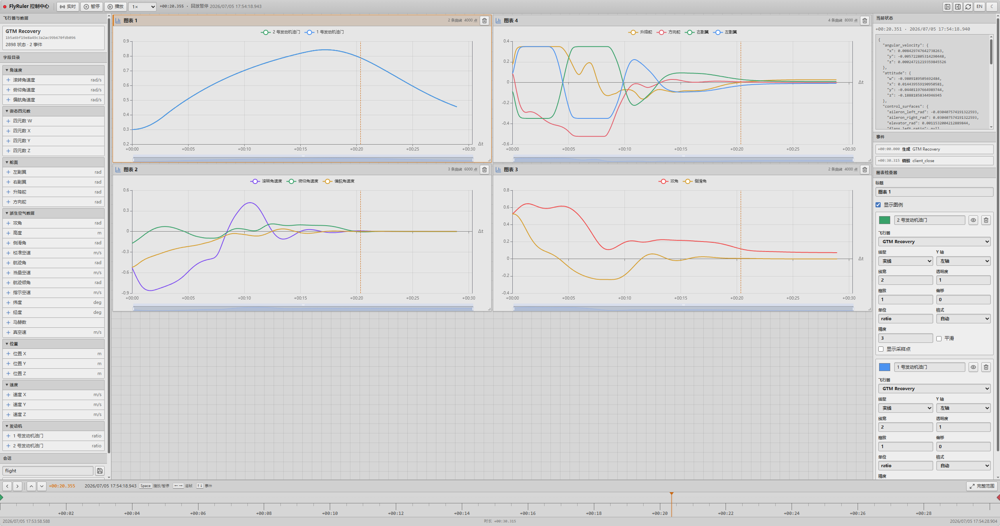
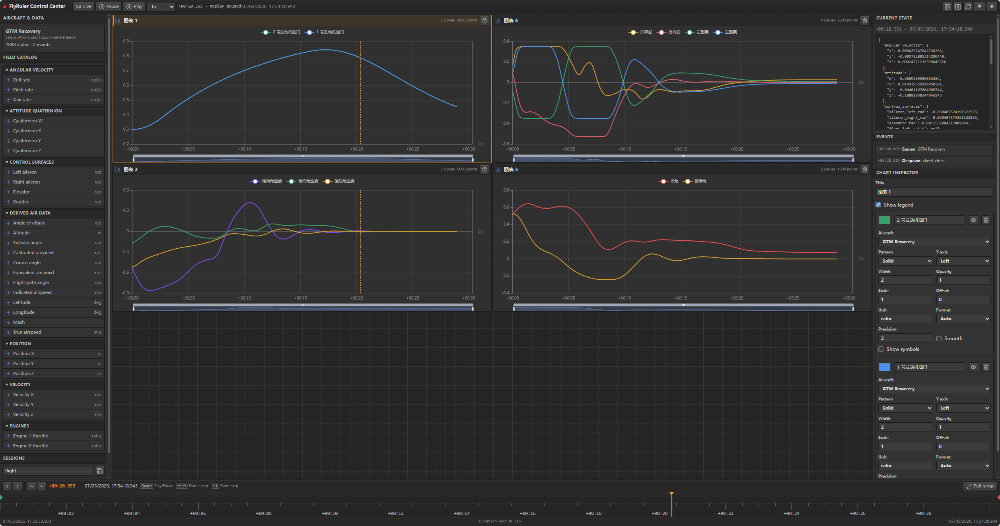

# FlyRuler Protocol

FlyRuler 的协议内核与多语言绑定。飞行器状态通过 protobuf/UDP 流入系统，内核在内存中维护可持久化的时序数据，并通过 HTTP、WebSocket 以及内置的 Web 控制台提供实时监控、历史曲线、事件导航、会话保存和全局回放。

你可以把它当作一个独立的飞行器状态中间件：只使用 `core` + `server` 就能搭建自己的仿真工具、地面站或可视化管线，内核自带一个 Web 管理服务器，无需依赖 MSFS 也能运行。`bindings/msfs` 是在此基础上实现的 Microsoft Flight Simulator 2024 SimConnect 桥接器，用于把外部 UDP 状态直接驱动到 MSFS 2024 的用户飞机。




## 核心能力

- **统一协议**：`core/proto/fly_ruler.proto` 是唯一 wire schema，Python 客户端、Godot 可视化、MSFS 2024 桥接器全部复用同一套数据模型。
- **时序数据内核**：基于 UDP 的会话管理、内存中的时序 Store、Parquet 持久化、回放与 seek API。
- **Schema-first telemetry**：client 在 spawn 时注册 aircraft/controller/sensor/runtime 等 stream，Web 可在首个 sample 到来前配置曲线。
- **内置 Web 管理服务器**：`fly-ruler-server` 直接托管前端 dist，浏览器打开即可管理飞行器、查看曲线、保存/加载会话、回放数据。
- **有界曲线显示**：Inspector 可配置每条曲线的显示点数，历史与实时数据使用 LTTB 降采样，且不删除 server 原始样本。
- **多语言绑定**：提供 Python、Godot 4 GDExtension，以及 MSFS 2024 桥接器。
- **自定义事件**：通过 UDP 发送事件（如 `flyruler.control.gear_up` / `gear_down`），无需扩展 protobuf schema。

## 快速开始：使用内核 + 内置 Web 服务器

不需要 MSFS 也能直接体验完整管理台：

```bash
# 安装 Rust、Python 与 Web 依赖
just setup

# 构建前端，然后启动独立管理服务器（同时托管 API 和 web/dist）
just build-web
just run-server

# 浏览器打开 http://127.0.0.1:18003/
```

server 会自动读取当前目录的 `fly-ruler-server.toml`。可从 [`server/fly-ruler-server.example.toml`](server/fly-ruler-server.example.toml) 复制模板，配置 UDP/HTTP 地址、heartbeat、会话目录、Web 资源、回放速度和日志；命令行参数仍可覆盖 TOML。

开发模式下可以分别启动后端和 Vite 开发服务器：

```bash
just dev-console          # 同时启动 Rust daemon + Vite 开发服务器
# 浏览器打开 http://localhost:5173/
```

然后启动一个 Python 示例发送端产生数据：

```bash
just build-python-dev
cd bindings/python
uv run python examples/demo_client.py
```

## 快速开始：与 MSFS 2024 集成

如果你要把外部飞行状态驱动到 MSFS 2024，按以下 5 步操作：

> 以下步骤面向**已发布包**；如需从源码编译，请跳到[开发构建](#开发构建)。MSFS SDK、Proton 配置、TOML 选项等细节见 [`bindings/msfs/README.md`](bindings/msfs/README.md)。

### 1. 下载 MSFS 桥接器

从 Release 页面下载最新 MSFS 2024 桥接包（包含 `fly-ruler-msfs-bridge.exe`、`SimConnect.dll`、示例 TOML 和内置 Web 控制台）：

```bash
wget https://github.com/WindLX/fly_ruler_proto/releases/download/v0.3.0/fly-ruler-msfs-windows-x86_64.zip
unzip fly-ruler-msfs-windows-x86_64.zip -d fly-ruler-msfs
```

### 2. 启动 MSFS 2024

进入一次自由飞行（Free Flight），并确保 **Active Pause 关闭**。桥接器会在首次收到有效 FlyRuler 状态后冻结纬度/经度/高度/姿态，避免 MSFS 自身物理模型与外部状态冲突。

### 3. 在 MSFS 2024 的 Proton 前缀中启动桥接器

```bash
cd fly-ruler-msfs
uv tool install protontricks
protontricks-launch --appid 2537590 \
  ./fly-ruler-msfs-bridge.exe
```

当终端出现 `SimConnect connected` 时即表示连接成功。`protontricks-launch` 可能会提示缺少 `winetricks`，只要桥接器继续打印连接信息，该警告可忽略。

### 4. 打开 Web 控制台

桥接器默认托管管理服务于 `http://127.0.0.1:18003/`。浏览器打开该地址即可看到实时数据面板。Release 包已包含 `web/dist`，无需单独构建前端。

### 5. 运行示例发送端

在另一终端中安装 Python 绑定并启动 MSFS 专用 demo：

```bash
just build-python-dev
cd bindings/python
uv run python examples/demo_msfs_client.py
```

示例会在桥接器坐标附近生成一个小半径地转圆，同时写入发动机油门、控制面偏角等。看到 MSFS 飞机被外部状态驱动，Web 控制台曲线随之更新，即说明集成成功。

## 项目组成

- `core/`：UDP 会话、时序 Store、Parquet 持久化、回放和管理 API。
- `server/`：独立 `fly-ruler-server` daemon，直接托管前端 dist，用于非 MSFS 场景。
- `web/`：Vue 3、Tailwind 4、Pinia 与 ECharts 管理台。
- `bindings/python/`：仿真/控制程序使用的 Python 客户端。
- `bindings/godot/`：Godot 4 GDExtension，供 `fly-ruler-viz` 可视化使用。
- `bindings/msfs/`：MSFS 2024 SimConnect 桥接器。
- `proto/`：唯一 protobuf wire schema。

默认地址为 UDP `127.0.0.1:18002` 和 HTTP/WS `127.0.0.1:18003`。Web 控制台内部使用原始秒时间戳查询和 seek，但以数据起点为零展示相对时间，并在 Unix 时间可用时同时显示本地绝对时间。

协议 request timestamp 是生产者定义的有限源时间轴秒数，而不是强制 Unix 时间。客户端省略 timestamp 时使用 Unix wall time；显式仿真时间可以从 0 开始，但同一 session 的 spawn、state、telemetry、event 与 despawn 必须使用一致时间基准。服务端使用本地单调接收时间判断 live state 是否 stale，因此仿真时间不会被错误地与 Unix 时间相减。

加载新的 Session 后，Web 控制台会校验持久化的查询范围和飞机绑定：失效的时间范围自动恢复为完整数据范围，单机 Session 自动迁移旧曲线绑定，多机 Session 可在右侧 Inspector 中手动重新绑定。

## 开发构建

```bash
# 安装 Rust、Python 与 Web 依赖
just setup

# 从源码启动 standalone 管理台
just dev-console

# 交叉编译 MSFS 2024 桥接器（Linux → Windows）
just build-msfs

# 构建完整的 MSFS 发布包（包含前端 dist、SimConnect.dll、文档等）
just package-msfs
```

## 统一更新版本号

发布前可以用仓库脚本一次性更新 Rust workspace、核心
`PROTOCOL_VERSION`、Cargo.lock、Python `pyproject.toml`、`uv.lock`、Web
`package.json` 以及文档中的 Release 链接/示例版本：

```bash
# 先预览会改哪些文件
just set-version 0.3.0 --dry-run

# 正式更新；也支持 v0.3.0 写法
just set-version 0.3.0
```

脚本只修改项目自身版本，不会创建 commit、tag 或上传包。更新后建议执行：

```bash
cargo metadata --format-version 1 >/dev/null
cd bindings/python && uv lock
cd ../../web && pnpm install --lockfile-only
```

更多命令：

```bash
just test
just check
just check-web
just run-msfs
just example-msfs
```

- MSFS 桥接器详细说明、SDK 获取、Proton 配置、TOML 与日志配置：[`bindings/msfs/README.md`](bindings/msfs/README.md)
- 管理 API、存储格式与回放语义：[`core/README.md`](core/README.md)
- Web 控制台开发说明：[`web/README.md`](web/README.md)
- Python 客户端使用：[`bindings/python/README.md`](bindings/python/README.md)
- Godot 绑定与可视化：[`bindings/godot/README.md`](bindings/godot/README.md)
- 总体架构：[`arch.md`](arch.md)

## 许可证

本项目采用 MIT 许可证，详见仓库根目录 [`LICENSE`](LICENSE) 文件。

## 发布

推送 `v*.*.*` tag 会触发完整 Release workflow。Web 控制台只构建一次，并同时装入 Linux server 压缩包和 MSFS zip。MSFS 发布包包含 EXE、`SimConnect.dll`、示例配置、文档、许可证、校验清单以及完整 `web/dist`，解压后无需另行下载前端。

发布流程、产物目录、SDK cache 和本地复现方法见 [`RELEASING.md`](RELEASING.md)。
