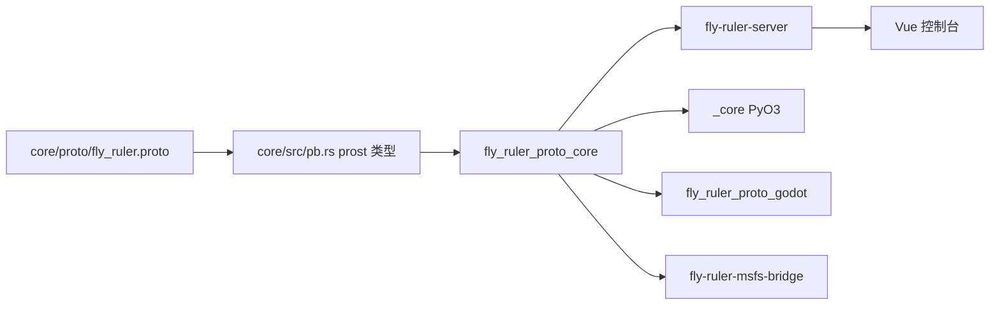

# FlyRuler Proto 架构

FlyRuler Proto 是一套以 protobuf 为 wire schema 的 UDP 运行时。产出方把飞行状态、事件与遥测帧发到一个 UDP 端点，内核按源时间戳把消息保序落库，管理接口再把查询结果与实时快照交给控制台和游戏侧订阅者。

## 组成

workspace 有五个成员（`Cargo.toml:2`），版本号在 `Cargo.toml:6` 与 `core/src/lib.rs:34` 两处同为 0.4.0。

| 构件 | 产物 | 职责 |
| --- | --- | --- |
| `core/` | 库 `fly_ruler_proto_core`（`core/Cargo.toml:2`） | wire schema 生成、UDP 传输、时间序列存储、回放、游标、内核与管理接口 |
| `server/` | 二进制 `fly-ruler-server`（`server/Cargo.toml:11`） | 把 core 装配成独立进程，监听 UDP 与管理面 |
| `bindings/python/` | cdylib `_core`（`bindings/python/Cargo.toml:7`） | PyO3 扩展，暴露协议类型与客户端 |
| `bindings/godot/` | cdylib `fly_ruler_proto_godot`（`bindings/godot/Cargo.toml:2`） | GDExtension，实验性，仅 Linux x86_64 |
| `bindings/msfs/` | 二进制 `fly-ruler-msfs-bridge`（`bindings/msfs/Cargo.toml:8`） | SimConnect 桥，只在 Windows 构建 |

`web/` 是配套的 Vue 3 控制台，属于 pnpm 工程，不进入 Rust workspace。

## 依赖方向

四个非 core 构件都只依赖 core，彼此之间没有代码依赖：`server/Cargo.toml:16`、`bindings/python/Cargo.toml:21`、`bindings/godot/Cargo.toml:11`、`bindings/msfs/Cargo.toml:12`。

## 数据流

一条状态从飞行模型走到控制台经过五步。

1. 产出方构造 `AircraftClient`，先发 `Handshake`（`core/src/transport/client.rs:51` 携带 `PROTOCOL_VERSION`），再在 spawn 中带上初始状态与遥测流声明。
2. `ServerRuntime` 按数据报校验版本与会话角色，回 ACK，并把合法 producer 事件交给内核回调（`core/src/transport/server.rs:446`、`core/src/transport/server.rs:539-551`）。
3. 内核闭包在 `IngestionGate` 内调用 `store.append_message_with_config`，把状态、事件与遥测帧按源时间戳写入（`core/src/kernel.rs:111-115`）。
4. `CursorStreamRuntime` 按配置频率从 store 与回放控制器组装 `CursorFrame`，经发布句柄分片发给游标订阅者（`core/src/kernel.rs:118-124`）。
5. 管理接口从同一份 store 与 playback 读取，控制台通过 HTTP/WS 拿到飞机列表、状态区间、事件与序列（`core/src/management/routes.rs:35-59`）。

## 读路径与写路径

写入 store 的正常入口只有内核注册的接收回调；管理面的批量改动会先暂停摄取再执行。

| 路径 | 入口 | 说明 |
| --- | --- | --- |
| 写 | `TimeSeriesStore::append_message_with_config`（`core/src/store.rs:323`） | 内核回调的唯一调用点 |
| 写 | `TimeSeriesStore::replace_from`、`clear`（`core/src/store.rs:774`、`:789`） | 会话加载与清空，包在 `with_paused` 内（`core/src/management/routes.rs:502-504`、`:375-376`） |
| 读 | `get_latest`、`get_states_page`、`get_events_page`（`core/src/store.rs:409`、`:511`、`:569`） | 管理接口的状态与事件查询 |
| 读 | `CursorClient`（`core/src/cursor.rs:529`） | 订阅端只接收推流，不改远端 store |

## core 分层

| 层 | 位置 | 规模 | 职责 |
| --- | --- | --- | --- |
| wire schema | `core/proto/fly_ruler.proto` | 308 行 | 消息、字段编号与枚举的唯一事实源 |
| 生成类型 | `core/src/pb.rs` | 91 行 | `include!` 构建期生成的 prost 类型 |
| 传输 | `core/src/transport/` | client 744 行、server 662 行 | UDP 会话、握手、心跳、角色与 ACK |
| 存储 | `core/src/store.rs` | 1687 行 | 时间序列追加与分页查询、Parquet 持久化 |
| 回放 | `core/src/playback.rs` | 512 行 | live 与 replay 共享时间线、速度与步进 |
| 游标 | `core/src/cursor.rs` | 1151 行 | 服务端快照分片发布与只读订阅客户端 |
| 内核 | `core/src/kernel.rs` | 314 行 | 把上述各层组装成运行时并管理生命周期 |
| 管理接口 | `core/src/management/` | routes 1230 行、series 982 行、server 791 行 | HTTP/WS 路由、序列目录、会话与工作区快照 |
| 配置 | `core/src/config.rs` | 297 行 | `RuntimeConfig` 与 TOML 文件段 |
| 日志 | `core/src/logging.rs` | 82 行 | tracing 订阅者初始化 |
| 事件 | `core/src/events.rs` | 7 行 | 保留的自定义事件名 |

`core/src/lib.rs:6` 打开 `missing_docs` 警告，`:7` 拒绝 `unsafe_code`，公开面由 `core/src/lib.rs:37-63` 的重导出固定。

## server 是 core 的可执行外壳

`server/src/main.rs` 共 44 行，只做装配：加载配置（`server/src/main.rs:10`）、构造 `TimeSeriesStore`（`:18`）、用 `KernelRuntime::with_config` 建内核（`:19`）、启动 UDP 服务（`:20`）、管理接口开启时启动 HTTP/WS（`:27-36`），最后等 Ctrl-C 后依次停管理面与 UDP（`:38-42`）。协议、存储与路由逻辑全部落在 core，server 不新增行为。

同样的装配在绑定侧也成立：MSFS 桥在进程内启动内核，`bindings/msfs/src/bridge.rs:32` 起 UDP 服务，`:39-40` 起管理接口；Godot 绑定调用 `KernelRuntime::start_server`（`bindings/godot/src/lib.rs:1052-1055`），并用 `CursorClient` 消费远端房间（`bindings/godot/src/lib.rs:1168`）。

## 部署形态

| 形态 | 进程 | 数据出口 |
| --- | --- | --- |
| 独立服务 | `fly-ruler-server` | 管理面 HTTP/WS 给控制台，UDP 游标流给订阅者 |
| 引擎内嵌 | MSFS 桥、Godot 扩展 | 引擎进程内托管内核，或由 `CursorClient` 订阅远端 |
| 脚本产出 | Python `_core` | 只做生产者，经 UDP 写入远端或本机服务 |

默认端口取 server 层：UDP `127.0.0.1:18002`（`server/src/config.rs:146`），管理面 `127.0.0.1:18003`（`server/src/config.rs:157`），会话根 `sessions` 与前端根 `web/dist`（`server/src/config.rs:158-169`）。

管理面托管前端时读取 `index.html` 并校验哨兵 `__FLY_RULER_RUNTIME_CONFIG__`，把 API 基址与 WebSocket 地址注入页面（`core/src/management/server.rs:47`、`:407-429`）。

## 共享状态与并发

内核把各层以 `Arc` 共享给并发的 UDP、游标与管理任务，同一份数据只有一套实例。

| 状态 | 类型 | 位置 |
| --- | --- | --- |
| 时间序列 | `Arc<TimeSeriesStore>`，内部 `RwLock<DashMap<..>>` 加实时收包时刻表 | `core/src/store.rs:190-196` |
| 回放时间线 | `Arc<PlaybackController>` | `core/src/kernel.rs:45` |
| 摄取闸门 | `Arc<IngestionGate>` | `core/src/kernel.rs:46` |
| 会话句柄 | `Arc<RwLock<Option<SessionHandle>>>` | `core/src/kernel.rs:47` |

管理服务拿到的是同一批 `Arc`（`core/src/kernel.rs:156-164`），因此控制台查询与游标发布读到的是一致的快照。

## 职责边界

core 只负责协议、传输、存储、回放与查询；界面回放、渲染插值与模型绑定属于消费方，由各绑定自行实现，MSFS 的插值就在 `bindings/msfs/src/smoothing.rs`。事件名只保留 `flyruler.control.gear_up` 与 `flyruler.control.gear_down` 两个公共约定（`core/src/events.rs:4-7`），其余自定义事件由产出方命名。

## 相关页面

- [Wire schema 与协议版本](/dev/components/proto/02-wire-schema)：字段编号、生成链路与两段式遥测
- [UDP 会话与可靠性](/dev/components/proto/03-udp-session)：握手、心跳、ACK 与游标分片
- [客户端连接](/guide/components/proto/02-client-connection)：产出方如何连上服务
- [接口参考](/dev/components/proto/api)：core 模块与绑定的公开名字
- [Python API 参考](/api/proto/)：逐条签名
