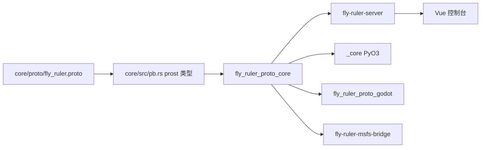

# 架构总览

这一页面向二次开发者，说明 FlyRuler Proto 的分层、各构件的职责，以及一条数据从客户端走到控制台的路径；只用 Python client 的用户请读使用手册 `docs/guide/01-install.md`，wire schema、UDP 会话与管理路由的实现细节见 `docs/dev/advanced/`。

FlyRuler Proto 是一套以 protobuf 为 wire schema 的 UDP 运行时：产出方把飞行状态、事件与遥测帧发到一个 UDP 端点，内核按源时间戳保序落库，管理面再把查询结果与实时快照交给控制台和引擎侧订阅者。

## 分层

架构从外到内分四层，每层只依赖它下面的一层。

- `core/` 是数据内核：wire schema 的生成类型、UDP 传输、时间序列存储、回放、游标、内核编排与管理接口都在这里，是所有绑定的公共依赖。
- `server/` 是独立进程外壳：把 core 装配成 `fly-ruler-server` 二进制，同时监听 UDP 与管理面，自身不新增协议或存储行为。
- `bindings/{python,msfs,godot}` 是三套绑定：Python 走 PyO3 暴露客户端，MSFS 桥在 Windows 进程内托管内核并用 SimConnect 写回模拟器，Godot 扩展在引擎进程内托管内核或订阅远端游标流。
- `web/` 是 Vue 3 控制台：被管理面托管在同一个 HTTP 端口上，通过 REST 与 WebSocket 读取内核状态。

## 构件与产物

workspace 有五个成员（`Cargo.toml:2`），版本号在 `Cargo.toml:6` 与 `core/src/lib.rs:34` 两处同为 0.4.0。

| 构件 | 产物 | 职责 |
| --- | --- | --- |
| `core/` | 库 `fly_ruler_proto_core`（`core/Cargo.toml:2`） | schema 生成类型、传输、存储、回放、游标、内核与管理接口 |
| `server/` | 二进制 `fly-ruler-server`（`server/Cargo.toml:11`） | 把 core 装配成独立进程，监听 UDP 与管理面 |
| `bindings/python/` | cdylib `_core`（`bindings/python/Cargo.toml:7`） | PyO3 扩展，暴露协议类型与客户端 |
| `bindings/godot/` | cdylib `fly_ruler_proto_godot`（`bindings/godot/Cargo.toml:2`） | GDExtension，实验性，仅 Linux x86_64 |
| `bindings/msfs/` | 二进制 `fly-ruler-msfs-bridge`（`bindings/msfs/Cargo.toml:8`） | SimConnect 桥，只在 Windows 构建 |
| `web/` | Vite 单页应用 | 控制台，pnpm 工程，不进入 Rust workspace |

四个非 core 构件都只依赖 core，彼此之间没有代码依赖：`server/Cargo.toml:16`、`bindings/python/Cargo.toml:21`、`bindings/godot/Cargo.toml:11`、`bindings/msfs/Cargo.toml:12`。

## core 的模块分层

| 层 | 位置 | 规模 | 职责 |
| --- | --- | --- | --- |
| wire schema | `core/proto/fly_ruler.proto` | 308 行 | 消息、字段编号与枚举的唯一事实源 |
| 生成类型 | `core/src/pb.rs` | 91 行 | `include!` 构建期生成的 prost 类型 |
| 传输 | `core/src/transport/` | client 744 行、server 662 行 | UDP 收发、会话表与角色校验 |
| 存储 | `core/src/store.rs` | 1687 行 | 时间序列追加与分页查询、Parquet 持久化 |
| 回放 | `core/src/playback.rs` | 512 行 | live 与 replay 共享时间线、速度与步进 |
| 游标 | `core/src/cursor.rs` | 1151 行 | 服务端快照分片发布与只读订阅客户端 |
| 内核 | `core/src/kernel.rs` | 314 行 | 把上述各层组装成运行时并管理生命周期 |
| 管理接口 | `core/src/management/` | routes 1230 行、series 982 行、server 791 行 | HTTP/WS 路由、序列目录、会话与工作区快照 |
| 配置 | `core/src/config.rs` | 297 行 | `RuntimeConfig` 与 TOML 文件段 |
| 日志 | `core/src/logging.rs` | 82 行 | tracing 订阅者初始化 |
| 事件 | `core/src/events.rs` | 7 行 | 保留的自定义事件名 |

`core/src/lib.rs:6` 打开 `missing_docs` 警告，`:7` 拒绝 `unsafe_code`，公开面由 `core/src/lib.rs:37-63` 的重导出固定；往下实现这些层时先看 `docs/dev/api.md` 里的模块清单。

## 一条数据的路径

一条状态的完整路径是：产出方（Python 或自定义程序）经 UDP 把生成、状态更新、事件与遥测帧上报到内核；传输层收包、校验会话与角色后，把合法消息交给内核注册的接收闭包；闭包在摄取闸门内调用存储写入，`TimeSeriesStore` 按飞机 ID 分片保存状态、事件与遥测；管理面从同一份 store 与回放控制器读取，通过 REST 查询与 WebSocket 推送交给浏览器里的 Vue 控制台；游标流走另一条 UDP 出口，把回放对齐的快照分片推给 Godot 或 MSFS 这类只读订阅者。传输与会话语义见 [UDP 会话与可靠性](advanced/udp-session.md)，数据模型与持久化见 [存储与回放](advanced/storage-playback.md)，这几层如何装配与共享见 [内核分层与并发](advanced/kernel-concurrency.md)，控制台拿到的接口见 [管理服务与 HTTP/WS 路由](advanced/management-api.md)。

## server 与绑定的装配方式

`server/src/main.rs` 共 44 行，只做装配：加载配置（`server/src/main.rs:10`）、构造 `TimeSeriesStore`（`:18`）、用 `KernelRuntime::with_config` 建内核（`:19`）、启动 UDP 服务（`:20`）、管理接口开启时启动 HTTP/WS（`:27-36`），最后等 Ctrl-C 后依次停管理面与 UDP（`:38-42`）。协议、存储与路由逻辑全部落在 core，server 不新增行为。

同样的装配在绑定侧也成立：MSFS 桥在进程内启动内核，`bindings/msfs/src/bridge.rs:32` 起 UDP 服务，`:38-39` 起管理接口；Godot 绑定调用 `KernelRuntime::start_server`（`bindings/godot/src/lib.rs:1055`）与 `start_management_server`（`bindings/godot/src/lib.rs:1064`），并用 `CursorClient` 消费远端房间（`bindings/godot/src/lib.rs:1168`）。

## 部署形态

| 形态 | 进程 | 数据出口 |
| --- | --- | --- |
| 独立服务 | `fly-ruler-server` | 管理面 HTTP/WS 给控制台，UDP 游标流给订阅者 |
| 引擎内嵌 | MSFS 桥、Godot 扩展 | 引擎进程内托管内核，或由 `CursorClient` 订阅远端 |
| 脚本产出 | Python `_core` | 只做生产者，经 UDP 写入远端或本机服务 |

默认端口取 server 层：UDP `127.0.0.1:18002`（`server/src/config.rs:146`），管理面 `127.0.0.1:18003`（`server/src/config.rs:157`），会话根 `sessions` 与前端根 `web/dist`（`server/src/config.rs:158-169`）。

管理面托管前端时读取 `index.html` 并校验哨兵 `__FLY_RULER_RUNTIME_CONFIG__`，把 API 基址与 WebSocket 地址注入页面（`core/src/management/server.rs:47`、`core/src/management/server.rs:407-429`）；控制台源码在 `web/src`，类型检查与构建见 `web/package.json:9`。

## 职责边界

core 只负责协议、传输、存储、回放与查询；界面回放、渲染插值与模型绑定属于消费方，由各绑定自行实现，MSFS 的插值就在 `bindings/msfs/src/smoothing.rs`。事件名只保留 `flyruler.control.gear_up` 与 `flyruler.control.gear_down` 两个公共约定（`core/src/events.rs:4-7`），其余自定义事件由产出方命名。

## 相关页面

- [wire schema 与兼容规则](advanced/wire-schema.md)：字段编号、生成链路与两段式遥测
- [UDP 会话与可靠性](advanced/udp-session.md)：握手、心跳、ACK 与游标分片
- [存储与回放](advanced/storage-playback.md)：store 与回放控制器的分工
- [管理服务与 HTTP/WS 路由](advanced/management-api.md)：管理路由族与推送帧
- [内核分层与并发](advanced/kernel-concurrency.md)：`KernelRuntime` 的组装与并发边界
- [Python 绑定](02-python-binding.md)、[控制台前端](03-console-frontend.md)、[MSFS 桥接](04-msfs-binding.md)、[扩展点与验证](05-extending.md)
- [接口参考](api.md)：core 模块与绑定的公开名字
