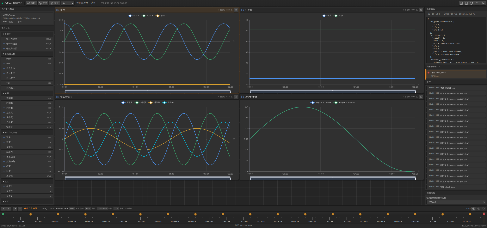
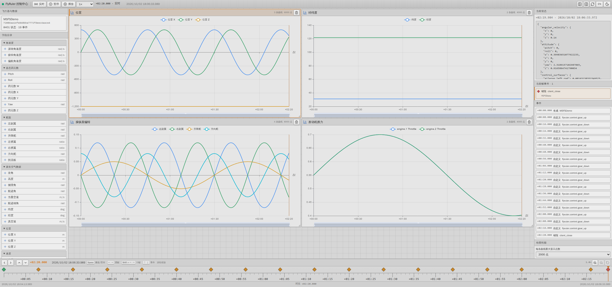
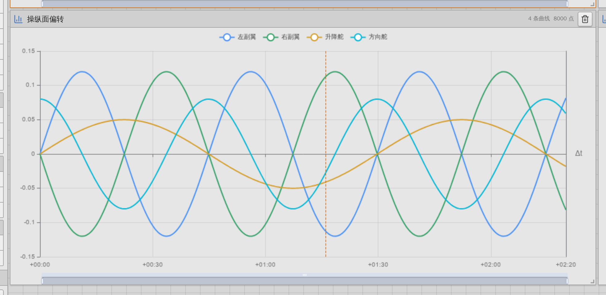
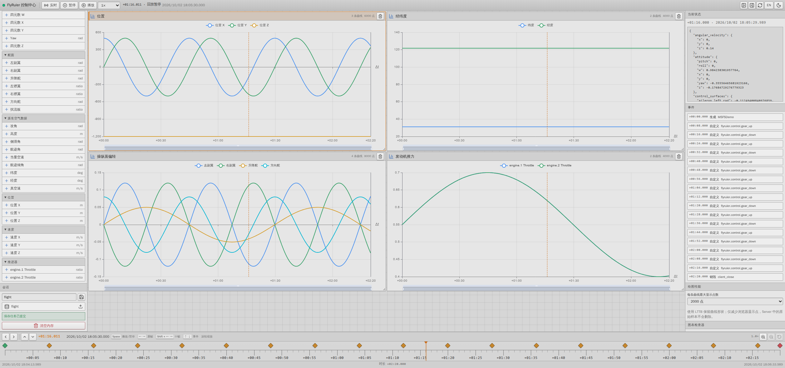
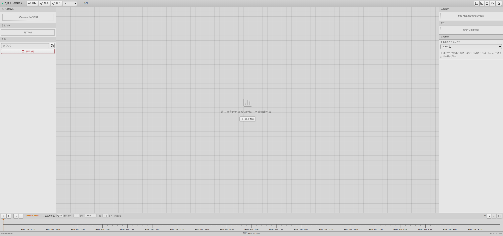

# 在 web console 里管理

web console 是随服务端同源托管的前端：读实时与历史数据、画曲线、回放、管会话与工作区都在这里完成。它自己不做飞行计算，也不负责把数据写进模拟器，那些由数据内核和 MSFS 桥承担。

## 打开控制台

桥或独立服务端跑起来之后，浏览器打开 `http://127.0.0.1:18003`。管理服务的 `web_root` 默认是 `web/dist`，目录里存在 `index.html` 时它就把前端托管在同一个端口上，页面与 `/api/v1/...` 接口同源（`core/src/management/server.rs:336-344`、`:405-411`）。

开发前端时让服务端继续开着，再执行 `just dev web`（即 `justfile:34-36` 里的 `cd web && pnpm dev`）。Vite 开发服务器监听 `http://127.0.0.1:5173`，把 `/api` 代理到 `http://127.0.0.1:18003` 并转发 WebSocket（`web/vite.config.ts:28-37`），开发模式用 5173 这个地址，生产托管用 18003。

## 数据从哪来

控制台显示的每个字段都来自客户端的 `update_state` 推送，服务端按飞机分别存成时间序列；事件来自 `create_event`，遥测帧来自 `publish_telemetry`。页面通过 WebSocket 接收增量更新，连接出错时工具栏下面会出现一条错误提示（`web/src/App.vue:107-109`）。

## 全貌

界面自上而下分四块：顶部回放工具栏、左中右三栏工作区、底部时间轴；左右两栏可以通过工具栏的按钮收起（`web/src/App.vue:104-117`）。

左栏有三段：飞行器与数据列出当前内存里的飞机，每行带「N 状态 · M 事件」；字段目录按位置、速度、姿态四元数、角速度、派生空气数据、舵面、推进器分组，供你挑选要画的曲线；会话用来保存和加载数据（`web/src/components/DataSidebar.vue:114-167`）。

中栏是图表工作区，可以并排放多张图，每张图里的每条曲线都能单独选中。右栏的图表检查器跟着当前选中的曲线走，能改标题、图例、所属飞机、线型、Y 轴左右、线宽、透明度、缩放、偏移、单位、格式与精度（`web/src/i18n.ts:74-105`）。

右栏还有三段：当前状态显示选中飞机在时间游标处的字段值；当前帧事件与事件列表显示生命周期事件和自定义事件，没有事件时显示「没有生命周期事件」；绘图性能里的「每条曲线最大显示点数」只影响浏览器里显示的点数，服务端保存的原始样本不受影响（`web/src/i18n.ts:75-81`）。

顶部工具栏右侧有一组按钮，其中太阳/月亮按钮用来在深色与浅色主题之间切换（`web/src/components/PlaybackToolbar.vue:45-47`、`:138-141`）。

## 看实时数据

数据推上来之后，先在左栏飞行器列表里选中一架飞机，再从字段目录勾选想要的字段，中栏就会出现对应曲线（`web/src/components/DataSidebar.vue:114-167`）。工具栏停在「实时」时曲线跟随服务端最新时间向前滚动。

选中任意一条曲线，右栏的图表检查器就会展开；线宽、单位、精度、格式、Y 轴归属都能在这里改，也可以隐藏或移除整条曲线（`web/src/i18n.ts:84-105`）。曲线多了以后把「每条曲线最大显示点数」调小，浏览器会轻快很多（`web/src/i18n.ts:80-81`）。

## 暂停与回放

顶部工具栏有「实时」「暂停」「播放」三种状态，旁边是播放速度，可选 0.1、0.25、0.5、1、2、4、8、16 倍（`web/src/components/PlaybackToolbar.vue:93`），上下限来自内核配置的 `min_speed` 与 `max_speed`（`core/src/config.rs:245-247`）。三种状态的名字来自界面文案（`web/src/i18n.ts:24-32`）。切到暂停后，时间轴就完全由你控制。

底部时间轴有逐帧与逐事件步进：逐帧按采样点前后走，逐事件按事件前后跳；相邻事件会合并成事件簇，点一下簇就跳到簇内下一个事件（`web/src/components/TimelineBar.vue:61-81`、`:210`、`:228-232`）。时间轴上滚轮可以缩放（`web/src/components/TimelineBar.vue:200-202`）。键盘快捷键：空格播放/暂停，左右方向键逐帧（按住 Shift 一次十帧），上下方向键逐事件，Home/End 跳到两端（`web/src/shortcuts.ts:8-31`）。

## 会话与工作区

左栏「会话」可以给当前内存里的数据起名保存到磁盘，也可以把磁盘上的会话加载回内存；「清空内存」只清掉服务端内存里的飞行数据，磁盘上的会话文件保留（`web/src/i18n.ts:50-51`）。

这些按钮背后是管理接口：`GET /api/v1/sessions` 列出会话，`POST /api/v1/sessions/{name}/save` 与 `POST /api/v1/sessions/{name}/load` 保存和加载，`POST /api/v1/memory/clear` 清空内存，`GET /api/v1/workspace` 与 `PUT /api/v1/workspace` 读写工作区（`core/src/management/routes.rs:51-56`）。

工作区记录的是界面自身状态：图表布局、曲线选择、当前飞机、面板开合、主题和每条曲线的最大显示点数。前端改动后会防抖写回服务端，下次打开还是原样（`web/src/stores/workspace.ts:24`、`:71`）。

## 还没有数据时

桥或服务端刚起来、客户端还没推数据时，控制台停在空态：飞行器列表显示「当前内存中没有飞行器」（`web/src/i18n.ts:38`），图表工作区没有曲线，时间轴也没有量程。这属于正常空态，只要有一帧状态到达，列表、字段目录和曲线就会立刻变得可用。

## 语言与主题

顶栏右侧还有语言按钮，可在中文与英文之间切换；主题按钮把选择写进 `document.documentElement.dataset.theme`（`web/src/components/PlaybackToolbar.vue:45-47`、`:135-137`）。语言、主题、面板开合都是工作区状态，会随工作区一起写回服务端，换台机器打开还是同样的布局。

## 控制台能做什么、不能做什么

能做的：读实时状态与历史状态、查事件、把任意字段画成曲线、在时间轴上暂停与回放、保存和加载会话、把工作区布局留到下次打开。

不能做的：控制台不能启动或停止桥进程，也不能改桥的参数。`--enable-ai-aircraft`、`--aircraft-id`、`--ai-aircraft-title`、`--max-ai-aircraft`、`--smoothing-mode`、`--interpolation-delay-ms`、`--max-extrapolation-ms` 这些开关与参数只能从命令行或 `fly-ruler-msfs.toml` 传入（`bindings/msfs/src/config.rs:16-63`）；管理路由表里没有任何进程控制端点（`core/src/management/routes.rs:33-57`）。要改配置就改 TOML 再重启桥。

## 相关页面

- [五分钟跑通](02-quickstart.md)
- [会话与回放](06-sessions.md)
- [用 Python client 控制飞行](04-control.md)
